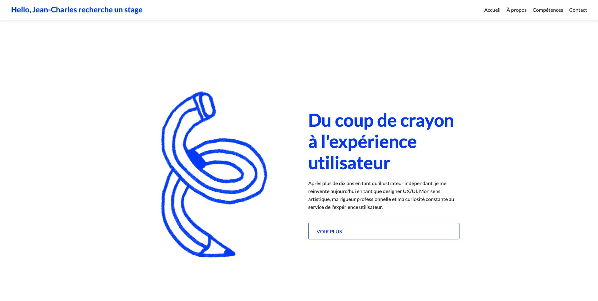

  
# 🌐 Landing Page – Jean-Charles recherche un stage

Bienvenue sur le dépôt de ma landing page personnelle, conçue pour présenter mon profil, mes compétences et mes objectifs de stage. 
Ce projet a pour but de faciliter les contacts professionnels et de centraliser les informations essentielles à propos de mon parcours.

🔗 **Lien vers la page :** (https://jean-charles-recherche-un-stage.netlify.app)

---

## ✨ Objectifs du projet

- Créer une landing page moderne, responsive et professionnelle
- Mettre en avant mon profil et mes compétences
- Faciliter la prise de contact pour un stage

---

## 🛠️ Technologies utilisées

- **HTML5** & **CSS3**
- **Netlify** 

---

